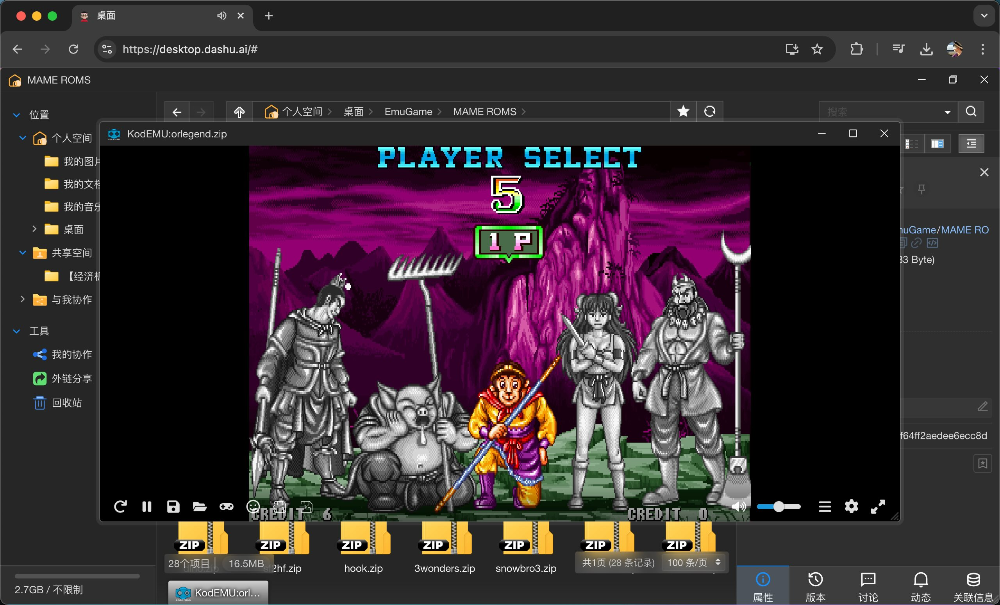
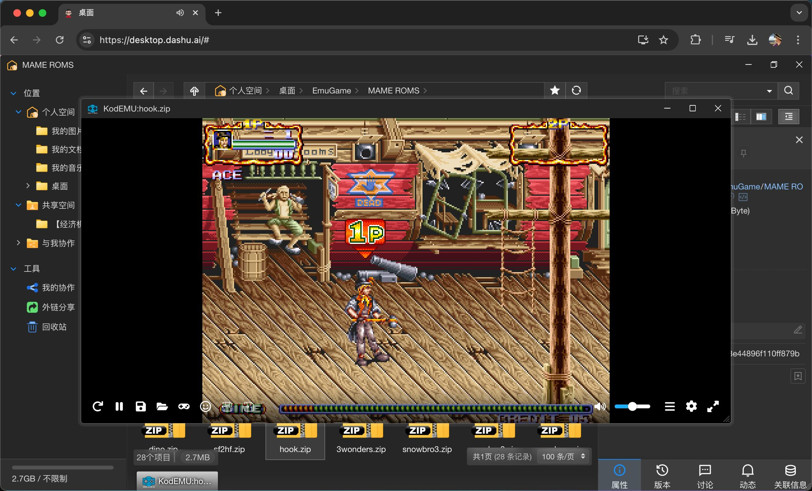

# KodEMU
코도 클라우드 KodBox로 다양한 휴대용 아케이드 게임을 온라인으로 실행하세요!

> 이 플러그인은 https://github.com/EmulatorJS/EmulatorJS 오픈 소스 코드를 사용하여 브라우저에서 휴대용 아케이드 게임을 실행할 수 있도록 지원합니다.

### 작성자 팔로우하기

| Twitter | Youtube | Bilibili | Wechat | 
| - | - | - | - |
|  |  |  |  |

### 사용 지침

이 플러그인 폴더를 KodBox의 루트 디렉토리에 있는 플러그인 폴더로 가져오세요.

KodBox 플러그인 관리 페이지에서 플러그인을 활성화합니다(플러그인이 표시되지 않는 경우 Ctrl+F5를 눌러 페이지를 새로고침하세요).

플러그인을 활성화한 후 KodBox 파일 관리 페이지로 들어가서 게임 롬 파일을 더블 클릭하여 게임을 시작합니다.

즐기세요! 함께 라이브와 플레이를 즐겨보세요!
